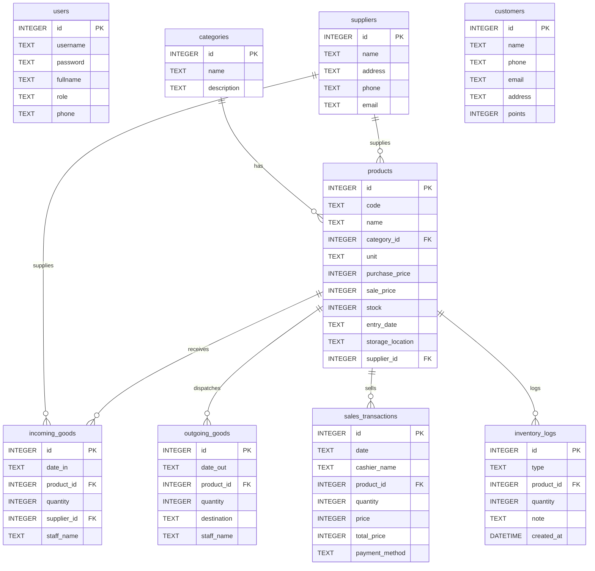

# Laporan Tugas Aplikasi Ngebrak Store

Dokumen ini dibuat untuk memudahkan pembuatan laporan tugas mengenai aplikasi Ngebrak Store. Isi file ini dapat langsung dijadikan kerangka laporan, dilengkapi dengan deskripsi sistem, arsitektur, ERD, dan daftar endpoint.

## 1. Tujuan Aplikasi
Aplikasi Ngebrak Store adalah sistem Inventory & POS (Point of Sale) berbasis web. Fitur utama:
- Login otentikasi role-based (`admin`, `kasir`, `gudang`)
- Dashboard ringkasan toko
- Manajemen produk, kategori, supplier, dan pelanggan
- POS kasir dengan keranjang dan checkout
- Pencatatan barang masuk gudang
- Laporan aktivitas inventori dan penjualan

## 2. Arsitektur Sistem
Aplikasi dibangun menggunakan:
- Backend: Node.js + Express
- Database: SQLite (`db.sqlite`)
- Frontend: HTML, CSS, JavaScript vanilla
- Struktur aplikasi:
  - `server.js`: server Express dan API
  - `public/index.html`: halaman login
  - `public/login.js`: logika login
  - `public/app.html`: shell dashboard/POS
  - `public/app.js`: logika aplikasi utama
  - `setup-db.js`: script inisialisasi/seed database

## 3. Modul Utama
1. Login
   - Halaman `public/index.html`
   - Endpoint `POST /api/login`
2. Dashboard
   - Halaman `public/app.html`
   - Menampilkan ringkasan produk, penjualan, stok rendah, aktivitas
3. Manajemen Produk
   - CRUD produk melalui API dan UI admin
4. Manajemen Kategori
   - Tambah kategori baru
5. Manajemen Supplier
   - Tambah supplier baru
6. Manajemen Pelanggan
   - Tambah data pelanggan
7. POS Kasir
   - Tambah produk ke keranjang
   - Checkout melalui `POST /api/sell`
8. Gudang
   - Catat barang masuk melalui `POST /api/incoming`

## 4. ERD (Entity Relationship Diagram)
Gunakan diagram ini sebagai basis visual untuk laporan tugas.

## 5. Database Schema
### Tabel `users`
- `id`, `username`, `password`, `fullname`, `role`, `phone`

### Tabel `categories`
- `id`, `name`, `description`

### Tabel `suppliers`
- `id`, `name`, `address`, `phone`, `email`

### Tabel `customers`
- `id`, `name`, `phone`, `email`, `address`, `points`

### Tabel `products`
- `id`, `code`, `name`, `category_id`, `unit`, `purchase_price`, `sale_price`, `stock`, `entry_date`, `storage_location`, `supplier_id`

### Tabel `incoming_goods`
- `id`, `date_in`, `product_id`, `quantity`, `supplier_id`, `staff_name`

### Tabel `outgoing_goods`
- `id`, `date_out`, `product_id`, `quantity`, `destination`, `staff_name`

### Tabel `sales_transactions`
- `id`, `date`, `cashier_name`, `product_id`, `quantity`, `price`, `total_price`, `payment_method`

### Tabel `inventory_logs`
- `id`, `type`, `product_id`, `quantity`, `note`, `created_at`

## 6. Daftar Endpoint API
### Autentikasi
- `POST /api/login`

### Overview
- `GET /api/overview`

### Produk
- `GET /api/products`
- `POST /api/products` (admin)
- `PUT /api/products/:id` (admin)
- `DELETE /api/products/:id` (admin)

### Kategori
- `GET /api/categories`
- `POST /api/categories` (admin)

### Supplier
- `GET /api/suppliers`
- `POST /api/suppliers` (admin)

### Pelanggan
- `GET /api/customers`
- `POST /api/customers` (admin)

### Barang Masuk
- `GET /api/incoming`
- `POST /api/incoming` (gudang)

### Barang Keluar
- `GET /api/outgoing`

### Penjualan
- `GET /api/sales`
- `POST /api/sell` (kasir)

## 7. Role dan Akses
- `admin`
  - Akses penuh aplikasi
  - CRUD produk, kategori, supplier, pelanggan
- `kasir`
  - Akses POS dan checkout
- `gudang`
  - Akses pencatatan barang masuk

## 8. Alur Penggunaan
1. Pengguna membuka `public/index.html`.
2. Login melalui `public/login.js` ke endpoint `/api/login`.
3. Menyimpan data user ke `localStorage` dengan key `ngebrakUser`.
4. Redirect ke `public/app.html`.
5. `public/app.js` memuat data awal dari `/api/overview`.
6. User memilih modul sesuai role.

## 9. Panduan Penulisan Laporan Tugas
Gunakan bagian-bagian di atas sebagai bab laporan:
- Pendahuluan: tujuan aplikasi dan teknologi
- Arsitektur: backend, frontend, database
- Use case: login, POS, manajemen produk, gudang
- ERD: salin diagram Mermaid atau gambar dari diagram
- API: daftar endpoint dan fungsinya
- Hasil pengujian: login, CRUD, checkout, laporan

## 10. Catatan Tambahan
- File penting: `server.js`, `public/app.html`, `public/app.js`, `public/login.js`, `setup-db.js`.
- Jika ingin membuat diagram lebih lengkap, gunakan ERD di atas sebagai dasar.
- Untuk tugas presentasi, cukup screenshot UI dan sertakan container modul serta endpoint.
